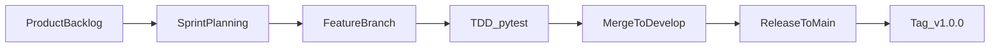
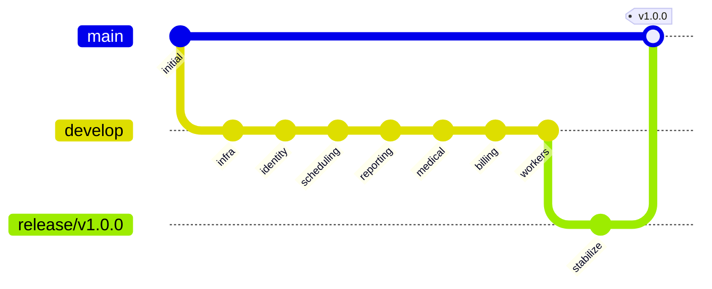

# Sistema Clínico — Plataforma de gestión médica basada en microservicios

Plataforma integral para la digitalización de procesos clínicos: gestión de identidad y acceso, agendamiento de citas, historias clínicas electrónicas, facturación, reportes y panel administrativo. El proyecto aplica **Domain-Driven Design (DDD)** en una arquitectura de microservicios y se desarrolló bajo la metodología **Extreme Programming (XP)**, con **integración continua** mediante un flujo GitFlow colaborativo.

**Repositorio:** [github.com/santtiag/clinic-system](https://github.com/santtiag/clinic-system)

**Desarrolladores:**

| Nombre | GitHub | Rol principal |
|--------|--------|---------------|
| Santiago Romero Solana | [`santtiag`](https://github.com/santtiag) | Infraestructura, Identity, Scheduling, Reporting/Admin |
| Eliel Berrio Ramos | [`RamosEliel`](https://github.com/RamosEliel) | Medical Record, Billing, Workers |

---

## Metodología de desarrollo: Extreme Programming (XP)

El equipo —conformado por dos integrantes— adoptó **Extreme Programming** como metodología principal, complementada con **Kanban** para la gestión visual del flujo de trabajo. Esta elección responde a la necesidad de maximizar la productividad en equipos pequeños, mantener un ritmo sostenible y detectar errores de forma temprana en un sistema que maneja información médica sensible.

La justificación académica completa se encuentra en [docs/proyecto_sistema_clinico.md](docs/proyecto_sistema_clinico.md).

### Prácticas XP implementadas

| Práctica XP | Evidencia en el proyecto |
|-------------|--------------------------|
| **Iteraciones cortas** | 4 sprints planificados en [docs/Product Backlog.csv](docs/Product%20Backlog.csv) y backlogs `docs/sprint_backlog_0..4.csv` |
| **Historias de usuario** | 18 HUs (HU-GIA, HU-AGC, HU-HCE, HU-FAP, HU-RPM) vinculadas a cada entrega funcional |
| **Integración continua** | Rama `develop` como trunk de integración + merges frecuentes por feature (ver sección siguiente) |
| **Desarrollo guiado por pruebas (TDD)** | `pytest` en 6 servicios backend, script `./scripts/run-tests.sh`, 12 pruebas unitarias documentadas |
| **Diseño simple / refactoring** | Arquitectura DDD por capas en cada microservicio: `domain/`, `application/`, `infrastructure/`, `presentation/` |
| **Trabajo en equipo** | División de responsabilidades por bounded context entre Santiago y Eliel |
| **Kanban complementario** | Tablero con columnas: pendiente → en progreso → en revisión → completado |

### Ciclo de desarrollo XP aplicado



Cada iteración sigue el ciclo: planificación desde el backlog → desarrollo en rama aislada → validación con pruebas → integración inmediata en `develop` → release periódico a `main`.

---

## Integración continua

La integración continua del proyecto se implementó mediante un **flujo GitFlow adaptado**, documentado paso a paso en [docs/continuous_integration.md](docs/continuous_integration.md). El principio central es integrar código de forma frecuente en una rama compartida (`develop`), validando cada entrega funcional antes de avanzar a la siguiente.

### Modelo de ramas

| Rama | Propósito |
|------|-----------|
| `main` | Código estable en producción. Tag de release: `v1.0.0` |
| `develop` | Trunk de integración continua donde convergen todas las features |
| `feature/*` | Una rama por entrega funcional, aislada del trunk hasta su validación |
| `release/v1.0.0` | Rama de estabilización previa al merge final a `main` |

### Ciclo por feature

Cada una de las 7 entregas siguió este ciclo repetible:

1. Posicionarse en `develop`: `git checkout develop`
2. Crear rama de feature: `git checkout -b feature/NOMBRE`
3. Desarrollar y commitear con **Conventional Commits**: `feat(área): descripción`
4. Subir y mergear a `develop` con `--no-ff` para mantener historia legible
5. Tras validar `develop` completo → crear `release/v1.0.0` → merge a `main` + tag anotado

```bash
# Ejemplo de merge con historia preservada
git checkout develop
git merge feature/identity-service --no-ff -m "merge: identity service (HU-GIA-01/02) [4]"
git push origin develop
```

### Flujo de integración (7 features → release)



### Entregas funcionales integradas

| # | Rama | Responsable | Historias de usuario | Entregable |
|---|------|-------------|---------------------|------------|
| 1 | `feature/infra-monitoring` | Santiago | — | Docker Compose, Kong API Gateway, Prometheus, Grafana, Loki, Jaeger |
| 2 | `feature/identity-service` | Santiago | HU-GIA-01, HU-GIA-02 | Autenticación JWT, registro de usuarios, control de roles |
| 3 | `feature/scheduling-service` | Santiago | HU-AGC-01, HU-AGC-02, HU-AGC-03, HU-AGC-05 | Citas, disponibilidad, cancelación/reprogramación, estados |
| 4 | `feature/reporting-admin-prometheus` | Santiago | HU-RPM-01, HU-RPM-02 | Reportes, panel administrativo, métricas Prometheus |
| 5 | `feature/medical-record-service` | Eliel | HU-HCE-02 | Historia clínica electrónica, evolución de pacientes |
| 6 | `feature/billing-service` | Eliel | HU-FAP-01, HU-FAP-02, HU-FAP-03 | Facturación automática, pagos, reembolsos |
| 7 | `feature/workers` | Eliel | HU-AGC-04, HU-GIA-03 | Notification Worker y Audit Worker (RabbitMQ) |

### Convención de commits

Los mensajes de commit siguen **Conventional Commits** para trazabilidad entre código, historias de usuario y merges:

```
feat(identity): implement identity service with JWT and DDD layers
merge: identity service (HU-GIA-01/02) [4]
feat(billing): implement billing service with automatic invoicing
merge: billing service (HU-FAP-01/02/03) [7]
release: clinic system v1.0.0
```

### Release a producción

Tras integrar las 7 features en `develop` y validar estabilidad:

```bash
git checkout develop
git checkout -b release/v1.0.0
git push -u origin release/v1.0.0

git checkout main
git merge release/v1.0.0 --no-ff -m "release: clinic system v1.0.0"
git tag -a v1.0.0 -m "Release v1.0.0 - Core microservices complete"
git push origin main
git push origin --tags
```

---

## Arquitectura técnica

```
                    Kong API Gateway (:8000)
                              |
    +------------+------------+------------+------------+------------+
    |            |            |            |            |            |
Identity     Scheduling    Medical      Billing     Reporting    Admin
  :8001        :8002        :8003        :8004        :8005       :8006
    |            |            |            |            |            |
    +------------+------------+------------+------------+------------+
                              |
              PostgreSQL (:5432) · RabbitMQ (:5672) · Redis (:6379)
                              |
              Notification Worker · Audit Worker
```

### Bounded contexts

| Contexto | Servicio | Puerto |
|----------|----------|--------|
| Gestión de Identidad y Acceso | Identity Service | 8001 |
| Agendamiento de Citas | Scheduling Service | 8002 |
| Historia Clínica Electrónica | Medical Record Service | 8003 |
| Facturación y Pagos | Billing Service | 8004 |
| Reportes Médicos | Reporting Service | 8005 |
| Panel Administrativo | Admin Panel | 8006 |
| Notificaciones | Notification Worker | — |
| Auditoría | Audit Worker | — |

### Stack tecnológico

| Capa | Tecnología |
|------|------------|
| Backend | Python 3.11+, FastAPI, SQLAlchemy 2.0 (async), Pydantic v2 |
| Frontend | Next.js 14+, React 18, TypeScript, Tailwind CSS |
| Base de datos | PostgreSQL 15 (una BD por servicio) |
| Mensajería | RabbitMQ 3.12, aio-pika |
| API Gateway | Kong 3.5 |
| Cache | Redis 7 |
| Monitoreo | Prometheus, Grafana, Loki, Jaeger |
| Testing | pytest, pytest-asyncio |
| Contenedores | Docker, Docker Compose |

Cada microservicio respeta los límites de DDD con capas internas:

```
service-name/
├── src/
│   ├── domain/           # Entidades, reglas de negocio
│   ├── application/      # Casos de uso, servicios de aplicación
│   ├── infrastructure/   # Repositorios, BD, mensajería
│   └── presentation/     # Routers FastAPI, schemas Pydantic
├── tests/
└── main.py
```

---

## Estrategia de pruebas (TDD)

Como práctica XP, las pruebas unitarias validan reglas de negocio antes y durante la integración. Se ejecutaron **12 pruebas** en 6 microservicios backend con **100% de éxito**, usando mocks (`AsyncMock`, `MagicMock`) sin depender de PostgreSQL, RabbitMQ ni datos reales.

| Microservicio | Pruebas | Resultado |
|---------------|---------|-----------|
| identity-service | 2 | 2/2 PASSED |
| scheduling-service | 2 | 2/2 PASSED |
| billing-service | 2 | 2/2 PASSED |
| medical-record-service | 2 | 2/2 PASSED |
| reporting-service | 2 | 2/2 PASSED |
| admin-panel | 2 | 2/2 PASSED |

### Ejecución de pruebas

```bash
# Todos los servicios backend
./scripts/run-tests.sh

# Servicio individual
cd services/identity-service
pip install -r requirements-dev.txt
pytest -v
```

El reporte detallado de cada prueba se encuentra en [docs/pruebas-unitarias-microservicios.md](docs/pruebas-unitarias-microservicios.md).

---

## Cómo ejecutar el proyecto

### Prerrequisitos

- Docker y Docker Compose
- Git

### Iniciar todos los servicios

```bash
docker-compose up -d
```

### Verificar estado

```bash
docker-compose ps
```

### Health checks

```bash
curl http://localhost:8001/health   # Identity
curl http://localhost:8002/health   # Scheduling
curl http://localhost:8003/health   # Medical Record
curl http://localhost:8004/health   # Billing
curl http://localhost:8005/health   # Reporting
curl http://localhost:8006/health   # Admin Panel
```

### Servicios de monitoreo

| Servicio | URL | Credenciales |
|----------|-----|--------------|
| Frontend | http://localhost:3001 | — |
| Kong API Gateway | http://localhost:8000 | — |
| Grafana | http://localhost:3000 | admin / admin |
| Prometheus | http://localhost:9090 | — |
| RabbitMQ Management | http://localhost:15672 | clinico / clinico_secret |
| Jaeger | http://localhost:16686 | — |

### Ver logs de un servicio

```bash
docker-compose logs -f identity-service
```

---

## Documentación adicional

| Documento | Descripción |
|-----------|-------------|
| [docs/proyecto_sistema_clinico.md](docs/proyecto_sistema_clinico.md) | Avance académico, problemática y justificación de XP |
| [docs/continuous_integration.md](docs/continuous_integration.md) | Guía GitFlow paso a paso para ambos desarrolladores |
| [docs/Product Backlog.csv](docs/Product%20Backlog.csv) | 18 historias de usuario priorizadas por sprint |
| [docs/pruebas-unitarias-microservicios.md](docs/pruebas-unitarias-microservicios.md) | Reporte de pruebas unitarias (12/12) |

---

## Equipo

Proyecto desarrollado como requisito de la **Electiva Profesional de Ingeniería del Software** — Corporación Universitaria del Caribe (CECAR), Sincelejo, 2026.

Docente: Laudyt María Lambraño Pérez
